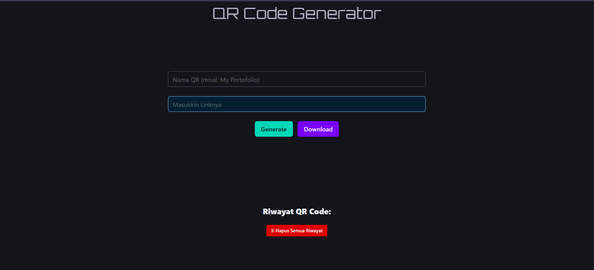

# 📱 QR Code Generator & Scanner

Sebuah  web sederhana untuk **membuat dan memindai QR Code** langsung dari browser. Tidak memerlukan instalasi, gratis digunakan, dan mendukung fitur riwayat, pengunduhan, serta tampilan modern yang responsif.

---

## 🚀 Fitur Utama

- ✅ Generate QR Code dari teks/link
- ✅ Simpan & tampilkan riwayat QR Code
- ✅ Download hasil QR sebagai gambar
- ✅ Desain responsif dengan Bulma CSS
- ✅ SweetAlert2 untuk alert yang interaktif
- ✅ Semua dilakukan langsung di browser tanpa backend

---

## 🛠️ Tech Stack

| Teknologi     | Keterangan                          |
|---------------|--------------------------------------|
| **HTML5**     | Struktur halaman                     |
| **CSS3**      | Gaya dasar                           |
| **JavaScript**| Interaktivitas dan logika utama      |
| **Bulma**     | Framework CSS modern dan ringan      |
| **SweetAlert2** | Tampilan popup interaktif         |
| **QRCode.js** | Library untuk membuat QR di canvas   |

---

## 📸 Tampilan Utama

---

## 🔗 Live Demo

👉 [Coba Aplikasinya](https://barcode-qr-maker.vercel.app/)  

---

## 📜 License

This project is licensed under the **MIT License** – see the [LICENSE](./LICENSE) file for details.

